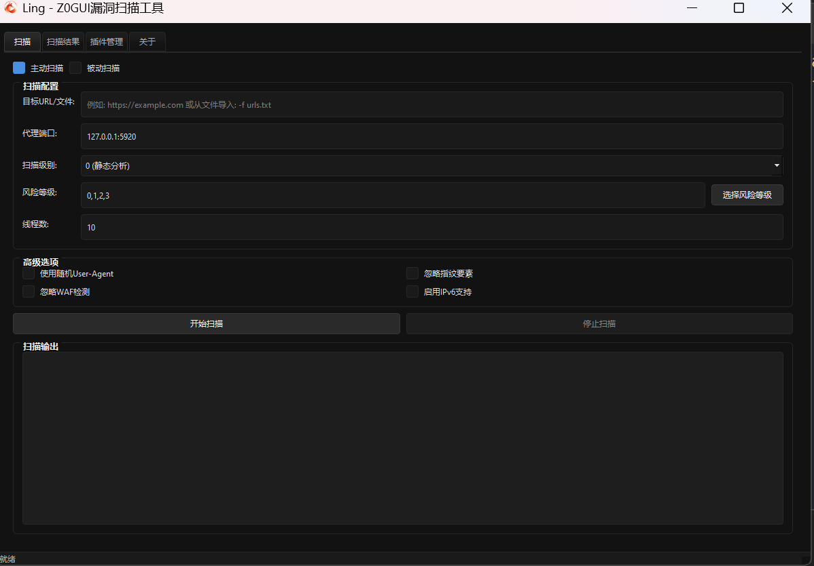
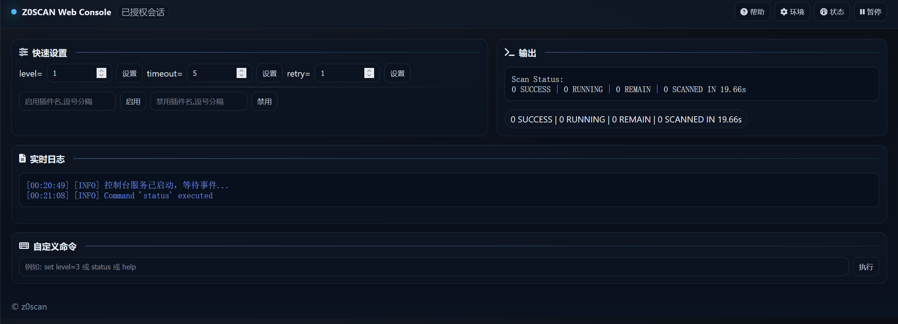
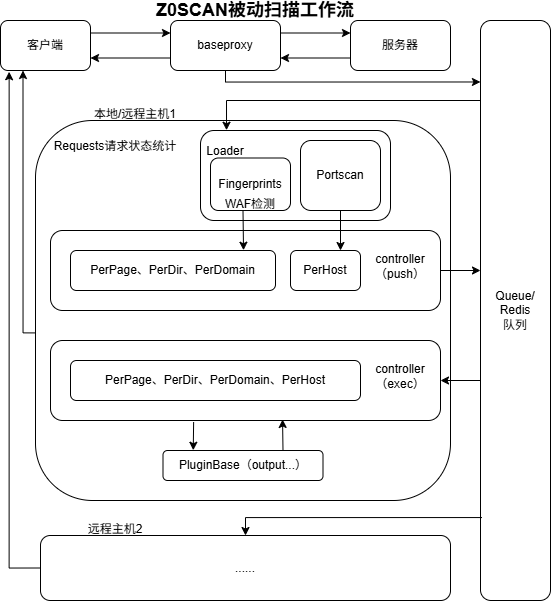

<h4 align="center" dir="auto">
  <a href="https://github.com/JiuZero/z0scan/blob/master/README.MD">中文</a> • <a href="https://jiuzero.github.io/tags/z0scan/">Guide</a> • <a href="https://github.com/JiuZero/z0scan/releases">Download</a> • <a href="https://github.com/JiuZero/z0scan/blob/master/doc/CHANGELOG.MD">Changelog</a>
<p>
  <a href="https://github.com/JiuZero/z0scan/stargazers"></a>
  <a href="https://github.com/JiuZero/z0scan/releases"></a>
  <a href="https://github.com/JiuZero/z0scan/releases"></a>
  <a href="https://github.com/JiuZero/z0scan/actions"></a>
  
  
  
  <a href="https://github.com/JiuZero/z0scan/issues"></a>
  <a href="https://www.gnu.org/licenses/gpl-2.0.en.html">
  </a>
</p>

## 😘 Acknowledgments

<div><table frame=void>
	<tr>
    <td align="center">
        
        <br>
        <a href="https://mp.weixin.qq.com/mp/profile_ext?action=home&__biz=Mzg4Mzg4OTIyMA====&scene=124#wechat_redirect"><sub>WeiLing Security</sub></a>
    </td>
    <td align="center">
        
        <br>
        <a href="https://mp.weixin.qq.com/mp/profile_ext?action=home&__biz=MzkxMzI5NzI5Mg==&scene=124#wechat_redirect"><sub>Blue Sword Lab</sub></a>
    </td>
    <td align="center">
        
        <br>
        <a href="https://mp.weixin.qq.com/mp/profile_ext?action=home&__biz=MzkzMjIxMDU5OA==&scene=124#wechat_redirect"><sub>ZAC Security</sub></a>
    </td>
    <td align="center">
        
        <br>
        <a href="https://mp.weixin.qq.com/mp/profile_ext?action=home&__biz=Mzk0NjQ2NzQ0Ng==&scene=124#wechat_redirect"><sub>Fengtian Security</sub></a>
    </td>
    <td align="center">
        
        <br>
        <a href="https://www.cn-fnst.top"><sub>Falcon Eye Security</sub></a>
    </td>
    <td align="center">
        
        <br>
        <a href="https://mp.weixin.qq.com/s/XvCq_kBAY-aDUH0uE3-oOQ"><sub>HackTwo</sub></a>
    </td>
    <td align="center">
        
        <br>
        <a href="https://xz.aliyun.com/users/141291/"><sub>ShennongSec</sub></a>
    </td>
    <td align="center">
        
        <br>
        <a href="javascript:void(0)"><sub>Cotton Candy</sub></a>
    </td>
  </tr>
  <tr>
    <td align="center">
        
        <br>
        <a href="https://mp.weixin.qq.com/mp/profile_ext?action=home&__biz=Mzk0MjY1ODE5Mg==&scene=124#wechat_redirect"><sub>WindChime Sec</sub></a>
    </td>
    <td align="center">
        
        <br>
        <a href="https://mp.weixin.qq.com/mp/profile_ext?action=home&__biz=MzU3MjU4MjM3MQ==&scene=124#wechat_redirect"><sub>Silver Shield Security</sub></a>
    </td>
    <td align="center">
        
        <br>
        <a href="https://xheishou.com"><sub>X Black Hand Network</sub></a>
    </td>
    <td align="center">
        
        <br>
        <a href="https://mp.weixin.qq.com/mp/profile_ext?action=home&__biz=MzkyNDYwNTcyNA==&scene=124#wechat_redirect"><sub>Sec Explorer</sub></a>
    </td>
    <td align="center">
        
        <br>
        <a href="https://mp.weixin.qq.com/mp/profile_ext?action=home&__biz=MzE5MTQ3MjE0OQ==&scene=124#wechat_redirect"><sub>Snow Mountain Alliance</sub></a>
    </td>
    <td align="center">
        
        <br>
        <a href="https://mp.weixin.qq.com/mp/profile_ext?action=home&__biz=Mzk0ODM0NDIxNQ==&scene=124#wechat_redirect"><sub>Night Team Security</sub></a>
    </td>
    <td align="center">
        
        <br>
        <a href="https://mp.weixin.qq.com/mp/profile_ext?action=home&__biz=MzkwNjczOTQwOA==&scene=124#wechat_redirect"><sub>Starfall Security</sub></a>
    </td>
    <td align="center">
        
        <br>
        <a href="https://mp.weixin.qq.com/mp/profile_ext?action=home&__biz=MzkzNTc0OTgwMA==&scene=124#wechat_redirect"><sub>Cyber-Tools</sub></a>
    </td>
  </tr>
</table></div>

---

## ✨ Core Features

<table>
  <tr>
    <td width="50%" valign="top">
      <h3>🔍 Security Detection</h3>
      <ul>
        <li><b>Fingerprint & Plugin Synergy</b> - WAF detection, fingerprint identification to guide plugin scanning</li>
        <li><b>Distributed & Local Integration</b> - Flexibly adapt to different scanning and scenario requirements</li>
        <li><b>Third-party Scanning Integration</b> - ObserverWard fingerprint detection, Nuclei POCs precision scanning</li>
        <li><b>Highly Customizable Plugin System</b> - Externally extensible and dynamically importable plugin system</li>
      </ul>
    </td>
    <td width="50%" valign="top">
      <h3>🌐 Deployment Architecture</h3>
      <ul>
        <li><b>Open Source & Deployment</b> - Python3 open source, supports Docker deployment, out-of-the-box releases</li>
        <li><b>High Performance</b> - Nuitka compilation, Rust cross-language</li>
        <li><b>Integrability</b> - Open API, allowing users to freely integrate scanning</li>
        <li><b>Fully Cross-platform</b> - Supports Windows, Linux, macOS and other systems</li>
      </ul>
    </td>
  </tr>
  <tr>
    <td width="50%" valign="top">
      <h3>📊 Data Processing</h3>
      <ul>
        <li><b>Complex Parameter Parsing</b> - Supports Json, XML and pseudo-static parameter parsing</li>
        <li><b>Secondary Parameter Parsing</b> - Supports parsing the values of GET and POST parameters as new parameters and automatically decoding them</li>
        <li><b>Data Storage</b> - Provides data storage support through SQLite3</li>
      </ul>
    </td>
    <td width="50%" valign="top">
      <h3>💡 Intelligent Verification</h3>
      <ul>
        <li><b>AI-driven JS Sensitive Information Verification</b> - Intelligently verify sensitive data in JavaScript</li>
      </ul>
    </td>
  </tr>
</table>

---

## 🚀 Installation

📢 Please take some time to read this documentation, which will help you quickly become familiar with Z0SCAN!

### ✔ Release Version 

Get the release version: [Download](https://github.com/JiuZero/z0scan/releases)  

- Want to build an executable file suitable for your environment? Please refer to: [Guide](https://jiuzero.github.io/tags/z0scan/)  

### ✔ Clone Installation

> [!Note]
> Gitee mirror: https://gitee.com/JiuZero/z0scan

```bash  
git clone https://github.com/JiuZero/z0scan
cd z0scan
pip install -r requirements.txt
playwright install
python3 z0.py help
```  

### ✔ Container Installation

```bash  
git clone https://github.com/JiuZero/z0scan
docker build -t z0scan .
docker run z0scan
# python3 z0.py help
```

## 📝 Usage Examples  

### **Ling - Visualization**

 

- Please go to Ling's [project page](https://github.com/JiuZero/Ling) to get it

> [!WARNING]
> Ling does not include the z0scan core, requires a locally available z0 executable file or script

### **z0 - Command Line**

### ✔ Passive Scanning  

> [!Note]
> HTTPS support - Start z0scan passive scanning, then visit http://z0scan.ca in your browser to download and trust the certificate

**Default configuration for passive scanning** (forward browser traffic to port 5920):  
```  
z0 scan -s 127.0.0.1:5920  
```  

  

Common recommended configuration:  
```  
z0 scan -s 127.0.0.1:5920 --risk 0,1,2,3 --level 2 --disable cmdi,unauth  
```  

**Console Interface**



### ✔ Active Scanning  

**Default configuration for active scanning**:
```  
# Passive scanning converted to active (recommended) via Burp/Yakit request traffic  
z0 scan -s 127.0.0.1:5920  
```  

  

```  
# Direct detection  
z0 scan -u https://example.com/?id=1
# Basic crawler (path depth 3) and detection  
z0 scan -u https://example.com/?id=1 -c 3
# Batch detection from URL list  
z0 scan -f urls.txt
# Sequential crawling from URL list (path depth 3) and detection  
z0 scan -f urls.txt -c 3
```  

  

- For more details, please refer to: [Documentation](https://jiuzero.github.io/tags/z0scan/)  

---

## 🔖 Plugin List

### **Page-level Scanning Plugins (PerPage)**

| Plugin Name | Function Description | Risk Level |
|:--------:|:--------:|:--------:|
| sqli-bool | SQL Boolean-based Blind Injection Detection | 2 |
| sqli-time | SQL Time-based Blind Injection Detection | 2 |
| sqli-error | SQL Error Injection Detection | 2 |
| codei-asp | ASP Code Execution Vulnerability Detection | 3 |
| codei-php | PHP Code Execution Vulnerability Detection | 3 |
| cmdi | System Command Execution Vulnerability Detection | 3 |
| objectdese | Deserialization Parameter Analysis | 3 |
| sensi-js | JavaScript Sensitive Information Leakage | 0 |
| sensi-jsonp | JSONP Sensitive Information Leakage | 1 |
| sensi-php-realpath | PHP Real Path Leakage | 0 |
| redirect | Redirection Vulnerability Detection | 1 |
| sensi-webpack | Webpack Source Code Leakage | 1 |
| other-webdav-passive | WebDAV Service Passive Detection | 1 |
| xpathi-error | Error-based XPath Injection Detection | 2 |
| trave-path | Path Traversal Vulnerability Detection | 2 |
| sensi-backup_1 | Backup File Detection (File-based) | 1 |
| sensi-viewstate | Unencrypted VIEWSTATE Discovery | 0 |
| xss | Semantic-based XSS Scanning | 1 |
| crlf_1 | CRLF Injection Vulnerability Detection | 2 |
| cors-passive | CORS Vulnerability Passive Analysis | 2 |
| unauth | Unauthorized Access Vulnerability Detection | 2 |
| leakpwd-page-passive | Login Page Weak Password Detection | 2 |
| sensi-editfile | Editor Backup File Leakage | 1 |
| sensi-sourcecode | Source Code Leakage Detection | 1 |
| other-captcha-bypass | CAPTCHA Bypass Detection | 0 |
| sensi-retirejs | Outdated JS Component Detection | -1 |
| ssti | Server-Side Template Injection Vulnerability Detection | 3 |
| ssti-angularjs | AngularJS Client-side Template Injection Detection | 2 |
| ssrf | Server-Side Request Forgery Vulnerability Detection | 2 |
| xxe | XML External Entity Injection Vulnerability Detection | 3 |
| xxe-blind | Blind XXE Data Exfiltration Detection | 3 |
| codei-java | Java Code Injection Vulnerability Scanning (EL/SpEL/OGNL) | 3 |
| redos | Regular Expression Denial of Service Vulnerability Scanning | -1 |
| jndi-error | JNDI Injection Vulnerability Scanning | 3 |

### **Directory-level Scanning Plugins (PerDir)**

| Plugin Name | Function Description | Risk Level |
|:--------:|:--------:|:--------:|
| sensi-backup_2 | Backup File Scanning (Directory-based) | 1 |
| trave-list_2 | Directory Traversal List Detection | 2 |
| sensi-files | Sensitive File Leakage Detection (such as phpinfo, .git, etc.) | 1 |
| upload-oss | OSS Storage Bucket Arbitrary File Upload Detection | 2 |
| sensi-frontpage | FrontPage Configuration Information Leakage | 1 |

### **Domain-level Scanning Plugins (PerDomain)**

| Plugin Name | Function Description | Risk Level |
|:--------:|:--------:|:--------:|
| sensi-errorpage | Error Page Sensitive Information Leakage | 0 |
| xss-net | .NET Generic XSS Detection | 1 |
| dns-zonetransfer | DNS Zone Transfer Vulnerability Detection | 1 |
| xss-flash | Flash Generic XSS Detection | 1 |
| idea-parse | Idea Directory Parsing | 1 |
| xst | Cross-Site Tracking Vulnerability Detection | -1 |
| unauth-webdav-active | WebDAV Service Discovery | 1 |
| upload-put | PUT Method-based Arbitrary File Upload Detection | 3 |
| sensi-backup_3 | Backup File Detection (Domain-based) | 1 |
| cors-active | CORS Vulnerability Active Detection | 2 |
| crlf_3 | CRLF Line Injection Vulnerability Detection | 2 |
| hosti | Host Header Injection Detection | 1 |
| takeover-oss | OSS Storage Bucket Takeover Vulnerability Detection | 3 |
| clickjacking | Clickjacking Vulnerability Detection | -1 |
| sensi-baseline | Service Version Information Leakage | -1 |
| smuggling | Request Smuggling Vulnerability Detection | 3 |
| trave-list_3 | Directory Listing Leakage Detection | 2 |

### **Host-level Scanning Plugins (PerHost)**

| Plugin Name | Function Description |
|:--------:|:--------:|
| leakpwd-mssql | MSSQL Server Weak Password Detection |
| leakpwd-mysql | MySQL Server Weak Password Detection |
| leakpwd-postgresql | PostgreSQL Server Weak Password Detection |
| leakpwd-redis | Redis Server Weak Password Detection |
| leakpwd-smb | SMB Server Weak Password Detection |
| leakpwd-activemq | ActiveMQ Server Weak Password Detection |
| ftp-anonymous | FTP Anonymous Login Detection |
| solr-rce | Apache Solr Velocity Template RCE Detection |
| unauth-docker | Docker Unauthorized Access Detection |
| unauth-jenkins | Jenkins Unauthorized Access Detection |
| unauth-memcached | Memcached Unauthorized Access Detection |
| unauth-mongodb | MongoDB Unauthorized Access Detection |
| unauth-resis | Redis Unauthorized Access Detection |
| unauth-rsync | Rsync Unauthorized Access Detection |
| unauth-solr | Apache Solr Unauthorized Access Detection |
| unauth-zookeeper | Zookeeper Unauthorized Access Detection |
| rce-javarmi | JavaRMI RCE Vulnerability Detection |
| leakpwd-ssh | SSH Server Weak Password Detection |
| unauth-ldaps | LDAP Unauthorized Access Detection |
| unauth-elastic | Elasticsearch Unauthorized Access Detection |

---

## 🔀 Workflow



---

## 🔗 Contact

- In my third year of high school, the project is maintained and updated irregularly QAQ
- Welcome masters to apply for collaboration positions with me~

<table>
  <tr>
    <td width="25%" valign="top">
      <h3>Official Account</h3>
      <ul>
        <li><b>90Safe</b></li>
      </ul>
    </td>
    <td width="25%" valign="top">
      <h3>WeChat</h3>
      <ul>
        <li><b>JiuZer1</b></li>
      </ul>
    </td>
    <td width="25%" valign="top">
      <h3>QQ</h3>
      <ul>
        <li><b>1703417187</b></li>
      </ul>
    </td>
    <td width="25%" valign="top">
      <h3>QQ Group</h3>
      <ul>
        <li><b>1058256508</b></li>
      </ul>
    </td>
  </tr>
</table>

---

## 🍀 Contributing

[](https://star-history.com/#JiuZero/z0scan&Date)

---

## 💖 Star Trend

<p align="center">
  <a href="https://star-history.com/#JiuZero/z0scan&Date">
    
  </a>
</p>