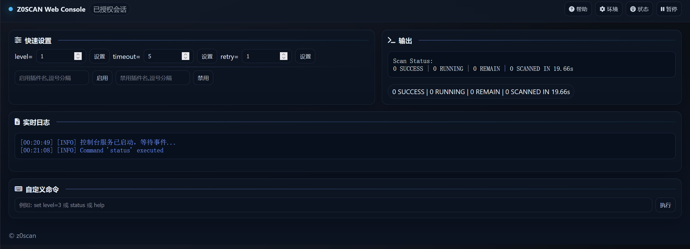

<h4 align="center" dir="auto">
  <a href="https://github.com/JiuZero/z0scan/blob/master/README.EN.MD">English</a> • <a href="https://jiuzero.github.io/tags/z0scan/">指南</a> • <a href="https://github.com/JiuZero/z0scan/releases">下载</a> • <a href="https://github.com/JiuZero/z0scan/blob/master/doc/CHANGELOG.MD">更新日志</a>
<p>
  <a href="https://github.com/JiuZero/z0scan/stargazers"></a>
  <a href="https://github.com/JiuZero/z0scan/releases"></a>
  <a href="https://github.com/JiuZero/z0scan/releases"></a>
  <a href="https://github.com/JiuZero/z0scan/actions"></a>
  
  
  
  <a href="https://github.com/JiuZero/z0scan/issues"></a>
  <a href="https://www.gnu.org/licenses/gpl-2.0.en.html">
  </a>
</p>

## 😘 致谢

<div><table frame=void>
	<tr>
    <td align="center">
        
        <br>
        <a href="https://mp.weixin.qq.com/mp/profile_ext?action=home&__biz=Mzg4Mzg4OTIyMA====&scene=124#wechat_redirect"><sub>威零安全</sub></a>
    </td>
    <td align="center">
        
        <br>
        <a href="https://mp.weixin.qq.com/mp/profile_ext?action=home&__biz=MzkxMzI5NzI5Mg==&scene=124#wechat_redirect"><sub>蓝剑实验室</sub></a>
    </td>
    <td align="center">
        
        <br>
        <a href="https://mp.weixin.qq.com/mp/profile_ext?action=home&__biz=MzkzMjIxMDU5OA==&scene=124#wechat_redirect"><sub>ZAC安全</sub></a>
    </td>
    <td align="center">
        
        <br>
        <a href="https://mp.weixin.qq.com/mp/profile_ext?action=home&__biz=Mzk0NjQ2NzQ0Ng==&scene=124#wechat_redirect"><sub>奉天安全</sub></a>
    </td>
    <td align="center">
        
        <br>
        <a href="https://www.cn-fnst.top"><sub>隼目安全</sub></a>
    </td>
    <td align="center">
        
        <br>
        <a href="https://mp.weixin.qq.com/s/XvCq_kBAY-aDUH0uE3-oOQ"><sub>HackTwo</sub></a>
    </td>
    <td align="center">
        
        <br>
        <a href="https://xz.aliyun.com/users/141291/"><sub>神农Sec</sub></a>
    </td>
    <td align="center">
        
        <br>
        <a href="javascript:void(0)"><sub>棉花糖</sub></a>
    </td>
  </tr>
  <tr>
    <td align="center">
        
        <br>
        <a href="https://mp.weixin.qq.com/mp/profile_ext?action=home&__biz=Mzk0MjY1ODE5Mg==&scene=124#wechat_redirect"><sub>风铃Sec</sub></a>
    </td>
    <td align="center">
        
        <br>
        <a href="https://mp.weixin.qq.com/mp/profile_ext?action=home&__biz=MzU3MjU4MjM3MQ==&scene=124#wechat_redirect"><sub>银遁安全</sub></a>
    </td>
    <td align="center">
        
        <br>
        <a href="https://xheishou.com"><sub>X黑手网络</sub></a>
    </td>
    <td align="center">
        
        <br>
        <a href="https://mp.weixin.qq.com/mp/profile_ext?action=home&__biz=MzkyNDYwNTcyNA==&scene=124#wechat_redirect"><sub>Sec探索者</sub></a>
    </td>
    <td align="center">
        
        <br>
        <a href="https://mp.weixin.qq.com/mp/profile_ext?action=home&__biz=MzE5MTQ3MjE0OQ==&scene=124#wechat_redirect"><sub>雪山盟</sub></a>
    </td>
    <td align="center">
        
        <br>
        <a href="https://mp.weixin.qq.com/mp/profile_ext?action=home&__biz=Mzk0ODM0NDIxNQ==&scene=124#wechat_redirect"><sub>夜组安全</sub></a>
    </td>
    <td align="center">
        
        <br>
        <a href="https://mp.weixin.qq.com/mp/profile_ext?action=home&__biz=MzkwNjczOTQwOA==&scene=124#wechat_redirect"><sub>星落安全</sub></a>
    </td>
    <td align="center">
        
        <br>
        <a href="https://mp.weixin.qq.com/mp/profile_ext?action=home&__biz=MzkzNTc0OTgwMA==&scene=124#wechat_redirect"><sub>Cyber-Tools</sub></a>
    </td>
  </tr>
</table></div>

---

## ✨ 核心特性

<table>
  <tr>
    <td width="50%" valign="top">
      <h3>🔍 安全检测</h3>
      <ul>
        <li><b>指纹与扫描插件联动</b> - WAF嗅探、指纹信息识别指导插件扫描</li>
        <li><b>分布式与本地式一体化</b> - 灵活适应不同的扫描与情景需求</li>
        <li><b>第三方绑定</b> - ObserverWard指纹检测、Nuclei POCs精准切入</li>
        <li><b>高自定义插件系统</b> - 可外部扩展并动态导入的插件系统</li>
        <li><b>无头爬虫支持</b> - 联动Crawlergo实现</li>
      </ul>
    </td>
    <td width="50%" valign="top">
      <h3>🌐 部署架构</h3>
      <ul>
        <li><b>开源与部署</b> - 基于Python3开源、支持Docker部署、发行版开箱即用</li>
        <li><b>高性能</b> - 采用Nuitka编译、Rust跨语言</li>
        <li><b>可集成性</b> - API开放、允许用户自由集成扫描</li>
        <li><b>完全跨平台</b> - 支持Windows、Linux、MacOS等系统</li>
      </ul>
    </td>
  </tr>
  <tr>
    <td width="50%" valign="top">
      <h3>📊 数据处理</h3>
      <ul>
        <li><b>复杂参数解析</b> - 支持Json、XML和伪静态参数解析</li>
        <li><b>二级参数解析</b> - 支持解析GET、POST参数的值作为新参数并自动解码</li>
        <li><b>数据存储</b> - 通过SQLite3提供数据存储支持</li>
      </ul>
    </td>
    <td width="50%" valign="top">
      <h3>💡 智能验证</h3>
      <ul>
        <li><b>AI驱动的JS敏感信息后验证</b> - 智能校验JavaScript中的敏感数据</li>
      </ul>
    </td>
  </tr>
</table>

---

## 🚀 安装

📢 请务必花一点时间阅读此文档，有助于你快速熟悉Z0SCAN！

### ✔ 发行版本 

获取发布版本：[下载](https://github.com/JiuZero/z0scan/releases)  

- 想要构建适合您环境的可执行文件？请参阅：[指南](https://jiuzero.github.io/tags/z0scan/)  

### ✔ 克隆安装

> [!Note]
> 国内码云：https://gitee.com/JiuZero/z0scan

```bash  
git clone https://github.com/JiuZero/z0scan
cd z0scan
pip install -r requirements.txt
python3 z0.py help
```  

### ✔ 容器安装

```bash  
git clone https://github.com/JiuZero/z0scan
docker build -t z0scan .
docker run z0scan
# python3 z0.py help
```

## 📝 使用示例  

### **Ling - 可视化**

 

- 请前往 Ling 的 [项目主页](https://github.com/JiuZero/Ling) 获取她

> [!WARNING]
> Ling 不包含 z0scan 核心, 需本地存在可用的 z0 可执行文件或脚本

### **z0 - 命令行**

> [!Note]
> Crawlergo无头爬虫、ObserverWard+Nuclei联动 - 需要配置Crawlergo或(ObserverWard与nuclei)到环境变量中，参阅：[指南](https://jiuzero.github.io/tags/z0scan/)  

### ✔ 被动扫描  

> [!Note]
> HTTPS支持 - 启动z0scan被动扫描，然后在浏览器中访问 http://z0scan.ca 下载证书并信任它

**被动扫描**的默认配置（将浏览器流量转发到端口5920）：  
```  
z0 scan -s 127.0.0.1:5920  
```  

  

常用推荐配置：  
```  
z0 scan -s 127.0.0.1:5920 --risk 0,1,2,3 --level 2 --disable cmdi,unauth  
```  

**控制台界面**



### ✔ 主动扫描  

**主动扫描**的默认配置：
```  
# 通过Burp/Yakit请求流量的主动化被动扫描（推荐）  
z0 scan -s 127.0.0.1:5920  
```  

  

```  
# 直接检测  
z0 scan -u https://example.com/?id=1
# 从URL列表进行批量检测
z0 scan -f urls.txt
# 爬虫并检测
z0 scan -u https://example.com/?id=1 --crawler
# 从URL列表中依次爬虫并检测
z0 scan -f urls.txt --crawler
```  

  

- 更多详细信息，请参阅：[文档](https://jiuzero.github.io/tags/z0scan/)  

---

## 🔖 插件列表

### **页面级扫描插件 (PerPage)**

| 插件名称 | 功能描述 | 风险等级 |
|:--------:|:--------:|:--------:|
| cmdi | Command Execution | 3 |
| cmdi-blind | Command Execution | 3 |
| codei-asp | ASP Code Execution | 3 |
| codei-java | Java Code Injection Vulnerability Scanner (EL/SpEL/OGNL) | 3 |
| codei-php | PHP Code Execution | 3 |
| cors-passive | CORS Vulnerability (Passive Analysis) | 1 |
| crlf_1 | CRLF Vulnerability Detection | 2 |
| fileinclude | File Include | 2 |
| jndi-error | JNDI Injection Vulnerability Scanner | 3 |
| jsonp | Jsonp Sensitive Information Leak & Jacking | 1 |
| ldap-error | Error-based LDAP Injection | 2 |
| leakpwd-page-passive | Weak Password on Login Page | 2 |
| objectdese | Deserialization Parameter Analysis | 3 |
| other-captcha-bypass | Frontend Captcha Bypass Detection | 0 |
| other-fastjson-blind | fastjson-blind | 2 |
| other-json-error | other-json-error | 2 |
| other-webdav-passive | WebDAV Service Passive Detection | 0 |
| redirect | Redirect Vulnerability | 1 |
| redos | Regular Expression Denial of Service (ReDoS) Vulnerability Scanner | -1 |
| sensi-backup_1 | Backup File Detection (File-based) | 1 |
| sensi-editfile | Editor Backup File Leak Detection | 1 |
| sensi-js | JS Sensitive Information Leak (with AI Context Validation) | 0 |
| sensi-php-realpath | PHP Real Path Discovery | 0 |
| sensi-retirejs | Outdated JS Component Detection | -1 |
| sensi-sourcecode | Source Code Disclosure Detection | 1 |
| sensi-viewstate | Unencrypted VIEWSTATE Discovery | 0 |
| sqli-bool | SQL Boolean-based Blind Injection | 2 |
| sqli-dnslog | sqli-dnslog | 2 |
| sqli-error | SQL Error-based Injection | 2 |
| sqli-time | SQL Time-based Blind Injection | 2 |
| ssrf | SSRF plugin detects server-side request forgery vulnerabilities via crafted payloads. | 2 |
| ssti | SSTI Vulnerability Detection | 3 |
| ssti-angularjs | AngularJS Client-Side Template Injection Detector | 2 |
| unauth | Unauthorized Access Vulnerability | 2 |
| webpack | Webpack Source Code Leak | 1 |
| xpathi-error | Error-based XPATH Injection | 2 |
| xss | JS Semantic-based XSS Scanning | 1 |
| xxe | XXE plugin detects XML external entity injection vulnerabilities via malicious payloads. | 3 |
| xxe-blind | Blind XXE plugin detects out-of-band data exfiltration. | 3 |

### **目录级扫描插件 (PerDir)**

| 插件名称 | 功能描述 | 风险等级 |
|:--------:|:--------:|:--------:|
| dirlisting | Directory browsing vulnerability (Directory-based) | 2 |
| sensi-backup_2 | Backup File Of Each Folder (Directory-based) | 1 |
| sensi-files | Sensitive File Leak (e.g., phpinfo, .git) | 1 |
| sensi-frontpage | FrontPage configuration information discloure | 1 |
| upload-oss | Detect the vulnerability of uploading arbitrary files to OSS | 3 |

### **域名级扫描插件 (PerDomain)**

| 插件名称 | 功能描述 | 风险等级 |
|:--------:|:--------:|:--------:|
| clickjacking | Clickjacking Vulnerability Scanner | -1 |
| cors-active | CORS Vulnerability (Active Detection) | 2 |
| crlf_3 | CRLF Line Injection Vulnerability (Domain-based) | 2 |
| dns-zonetransfer | DNS Zone Transfer Vulnerability | 1 |
| hosti | Host Header Injection Detection | 1 |
| idea-parse | Idea Parse | 1 |
| listing | Listing | 2 |
| oss-takeover | OSS Bucket Takeover | 3 |
| sensi-backup_3 | Backup File Detection (Domain-based) | 1 |
| sensi-baseline | Check for version leak on response | -1 |
| sensi-errorpage | Leak information in Error Page | 0 |
| smuggling | Request Smuggling Vulnerability | 3 |
| unauth-webdav-active | WebDAV authentication bypass vulnerability, | 1 |
| upload-put | PUT-based Arbitrary File Upload | 3 |
| xss-flash | Flash SWF XSS | 1 |
| xss-net | .NET XSS | 1 |
| xst | XST Vulnerability Detection | -1 |

### **主机级扫描插件 (PerHost)**

| 插件名称 | 功能描述 |
|:--------:|:--------:|
| leakpwd-activemq | Weak Password on ActiveMQ |
| leakpwd-mssql | Weak Password on MSSQL Server |
| leakpwd-mysql | Weak Password on MySQL Server |
| leakpwd-postgresql | Weak Password on PostgreSQL Server |
| leakpwd-redis | Weak Password on Redis Server |
| leakpwd-smb | Weak Password on SMB Server |
| leakpwd-ssh | Weak Password on SSH Server |
| other-ftp-anonymous | FTP anonymous Login |
| rce-javarmi | Check the JavaRMI RCE |
| rce-solr | Apache Solr RCE via Velocity |
| unauth-docker | Docker Unauthorized Access |
| unauth-elastic | Elasticsearch Unauthorized Access |
| unauth-jenkins | Jenkins Unauthorized Access |
| unauth-ldaps | Ldaps Unauthorized Access |
| unauth-memcache | Memcache Unauthorized Access |
| unauth-mongodb | Mongodb Unauthorized Access |
| unauth-resis | Redis Unauthorized Access |
| unauth-rsync | Rsync Unauthorized Access |
| unauth-solr | Apache Solr Unauthorized Access |
| unauth-zookeeper | Zookeeper Unauthorized access |

th="25%" valign="top">
      <h3>QQ</h3>
      <ul>
        <li><b>1703417187</b></li>
      </ul>
    </td>
    <td width="25%" valign="top">
      <h3>QQ交流群</h3>
      <ul>
        <li><b>1058256508</b></li>
      </ul>
    </td>
  </tr>
</table>

---

## 🍀 贡献

<a href="https://github.com/JiuZero/z0scan/graphs/contributors">
  
</a>


---

## 💖 星标趋势

[](https://star-history.com/#JiuZero/z0scan&Date)