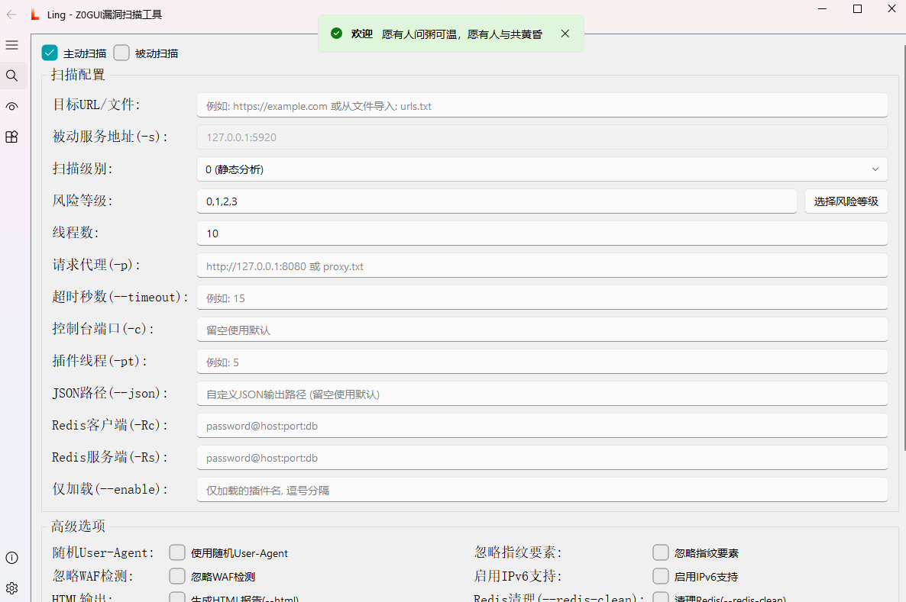

<h4 align="center" dir="auto">
  <a href="https://jiuzero.github.io/tags/z0scan/">官方文档</a> • <a href="https://github.com/JiuZero/z0scan/releases">下载发行版</a> • <a href="https://github.com/JiuZero/z0scan/blob/master/doc/CHANGELOG.MD">更新日志</a>
<p>
  <a href="https://github.com/JiuZero/z0scan/stargazers"></a>
  <a href="https://github.com/JiuZero/z0scan/releases"></a>
  <a href="https://github.com/JiuZero/z0scan/releases"></a>
  <a href="https://github.com/JiuZero/z0scan/actions"></a>
  
  
  
  <a href="https://github.com/JiuZero/z0scan/issues"></a>
  <a href="https://www.gnu.org/licenses/gpl-2.0.en.html">
  </a>
</p>

## 😘 致谢

<div><table frame=void>
	<tr>
    <td align="center">
        
        <br>
        <a href="https://mp.weixin.qq.com/mp/profile_ext?action=home&__biz=Mzg4Mzg4OTIyMA====&scene=124#wechat_redirect"><sub>威零安全</sub></a>
    </td>
    <td align="center">
        
        <br>
        <a href="https://mp.weixin.qq.com/mp/profile_ext?action=home&__biz=MzkxMzI5NzI5Mg==&scene=124#wechat_redirect"><sub>蓝剑实验室</sub></a>
    </td>
    <td align="center">
        
        <br>
        <a href="https://mp.weixin.qq.com/mp/profile_ext?action=home&__biz=MzkzMjIxMDU5OA==&scene=124#wechat_redirect"><sub>ZAC安全</sub></a>
    </td>
    <td align="center">
        
        <br>
        <a href="https://mp.weixin.qq.com/mp/profile_ext?action=home&__biz=Mzk0NjQ2NzQ0Ng==&scene=124#wechat_redirect"><sub>奉天安全</sub></a>
    </td>
    <td align="center">
        
        <br>
        <a href="https://www.cn-fnst.top"><sub>隼目安全</sub></a>
    </td>
    <td align="center">
        
        <br>
        <a href="https://mp.weixin.qq.com/s/XvCq_kBAY-aDUH0uE3-oOQ"><sub>HackTwo</sub></a>
    </td>
    <td align="center">
        
        <br>
        <a href="https://xz.aliyun.com/users/141291/"><sub>神农Sec</sub></a>
    </td>
    <td align="center">
        
        <br>
        <a href="javascript:void(0)"><sub>棉花糖</sub></a>
    </td>
  </tr>
  <tr>
    <td align="center">
        
        <br>
        <a href="https://mp.weixin.qq.com/mp/profile_ext?action=home&__biz=Mzk0MjY1ODE5Mg==&scene=124#wechat_redirect"><sub>风铃Sec</sub></a>
    </td>
    <td align="center">
        
        <br>
        <a href="https://mp.weixin.qq.com/mp/profile_ext?action=home&__biz=MzU3MjU4MjM3MQ==&scene=124#wechat_redirect"><sub>银遁安全</sub></a>
    </td>
    <td align="center">
        
        <br>
        <a href="https://xheishou.com"><sub>X黑手网络</sub></a>
    </td>
    <td align="center">
        
        <br>
        <a href="https://mp.weixin.qq.com/mp/profile_ext?action=home&__biz=MzkyNDYwNTcyNA==&scene=124#wechat_redirect"><sub>Sec探索者</sub></a>
    </td>
    <td align="center">
        
        <br>
        <a href="https://mp.weixin.qq.com/mp/profile_ext?action=home&__biz=MzE5MTQ3MjE0OQ==&scene=124#wechat_redirect"><sub>雪山盟</sub></a>
    </td>
    <td align="center">
        
        <br>
        <a href="https://mp.weixin.qq.com/mp/profile_ext?action=home&__biz=Mzk0ODM0NDIxNQ==&scene=124#wechat_redirect"><sub>夜组安全</sub></a>
    </td>
    <td align="center">
        
        <br>
        <a href="https://mp.weixin.qq.com/mp/profile_ext?action=home&__biz=MzkwNjczOTQwOA==&scene=124#wechat_redirect"><sub>星落安全</sub></a>
    </td>
    <td align="center">
        
        <br>
        <a href="https://mp.weixin.qq.com/mp/profile_ext?action=home&__biz=MzkzNTc0OTgwMA==&scene=124#wechat_redirect"><sub>Cyber-Tools</sub></a>
    </td>
  </tr>
</table></div>

---

## 🔗 联系

- 高三在校，项目不定期维护更新QAQ
- 欢迎大师傅们向我申请协作位吖~

<table>
  <tr>
    <td width="25%" valign="top">
      <h3>公众号</h3>
      <ul>
        <li><b>90Safe</b></li>
      </ul>
    </td>
    <td width="25%" valign="top">
      <h3>微信</h3>
      <ul>
        <li><b>JiuZer1</b></li>
      </ul>
    </td>
    <td width="25%" valign="top">
      <h3>QQ</h3>
      <ul>
        <li><b>1703417187</b></li>
      </ul>
    </td>
    <td width="25%" valign="top">
      <h3>QQ交流群</h3>
      <ul>
        <li><b>1058256508</b></li>
      </ul>
    </td>
  </tr>
</table>

---

## ✨ 核心特性

<table>
  <tr>
    <td width="50%" valign="top">
      <h3>🔍 安全检测</h3>
      <ul>
        <li><b>集成指纹检测</b> - WAF嗅探并被动化识别指纹信息(5900+)，插件精准切入</li>
        <li><b>分布式与本地式一体化</b> - 灵活适应不同扫描需求</li>
        <li><b>插件扫描</b> - 可外部扩展的插件系统</li>
      </ul>
    </td>
    <td width="50%" valign="top">
      <h3>📊 数据处理</h3>
      <ul>
        <li><b>复杂参数解析</b> - 支持Json、XML和伪静态参数解析</li>
        <li><b>数据存储</b> - 通过SQLite3提供数据存储支持</li>
      </ul>
    </td>
  </tr>
  <tr>
    <td width="50%" valign="top">
      <h3>🌐 部署架构</h3>
      <ul>
        <li><b>开源、高性能</b> - 基于Python开源、使用Nuitka编译</li>
        <li><b>完全跨平台</b> - 支持Windows、Linux、MacOS等系统</li>
      </ul>
    </td>
    <td width="50%" valign="top">
      <h3>💡 智能验证</h3>
      <ul>
        <li><b>AI驱动的JS敏感信息后验证</b> - 智能校验JavaScript中的敏感数据</li>
      </ul>
    </td>
  </tr>
</table>

---

## 🚀 安装

📢 请务必花一点时间阅读此文档，有助于你快速熟悉Z0SCAN！

### ✔ 发行版本 

获取发布版本：[下载](https://github.com/JiuZero/z0scan/releases)  

- 想要构建适合您环境的可执行文件？请参阅：[文档](https://jiuzero.github.io/tags/z0scan/)  

### ✔ GitHub克隆安装

> [!Note]
> 国内码云：https://gitee.com/JiuZero/z0scan

```bash  
git clone https://github.com/JiuZero/z0scan
cd z0scan
pip install -r requirements.txt
python3 z0.py help
```  

### ✔ Docker安装

```bash  
git clone https://github.com/JiuZero/z0scan
docker build -t z0scan .
docker run z0scan
# python3 z0.py help
```

## 📝 使用示例  

### **Ling - 可视化**

 

- 请前往 Ling 的 [项目主页](https://github.com/JiuZero/Ling) 获取她

> [!WARNING]
> Ling 不包含 z0scan 核心, 需本地存在可用的 z0 可执行文件或脚本

### **z0 - 命令行**

### ✔ 被动扫描  

> [!Note]
> HTTPS支持 - 启动z0scan被动扫描，然后在浏览器中访问 http://z0scan.ca 下载证书并信任它

**被动扫描**的默认配置（将浏览器流量转发到端口5920）：  
```  
z0 scan -s 127.0.0.1:5920  
```  

  

常用推荐配置：  
```  
z0 scan -s 127.0.0.1:5920 --risk 0,1,2,3 --level 2 --disable cmdi,unauth  
```  

**控制台界面**


### ✔ 主动扫描  

**主动扫描**的默认配置：
```  
# 通过Burp/Yakit请求流量的主动化被动扫描（推荐）  
z0 scan -s 127.0.0.1:5920  
```  

  

```  
# 直接检测  
z0 scan -u https://example.com/?id=1
# 基础爬虫（路径深度为3）并检测
z0 scan -u https://example.com/?id=1 -c 3
# 从URL列表进行批量检测
z0 scan -f urls.txt
# 从URL列表中依次爬虫（路径深度为3）并检测
z0 scan -f urls.txt -c 3
```  

  

- 更多详细信息，请参阅：[文档](https://jiuzero.github.io/tags/z0scan/)  

---

## 🔖 插件列表

### **页面级扫描插件 (PerPage)**

| 插件名称 | 功能描述 | 风险等级 |
|:--------:|:--------:|:--------:|
| sqli-bool | SQL布尔盲注检测 | 2 |
| sqli-time | SQL时间盲注检测 | 2 |
| sqli-error | SQL报错注入检测 | 2 |
| codei-asp | ASP代码执行漏洞检测 | 3 |
| codei-php | PHP代码执行漏洞检测 | 3 |
| cmdi | 系统命令执行漏洞检测 | 3 |
| objectdese | 反序列化参数分析 | 3 |
| sensi-js | JavaScript敏感信息泄露 | 0 |
| sensi-jsonp | JSONP敏感信息泄露 | 1 |
| sensi-php-realpath | PHP真实路径泄露 | 0 |
| redirect | 重定向漏洞检测 | 1 |
| sensi-webpack | Webpack源码泄露 | 1 |
| webdav-passive | WebDAV服务被动检测 | 1 |
| xpathi-error | 报错型XPath注入检测 | 2 |
| trave-path | 路径遍历漏洞检测 | 2 |
| sensi-backup_1 | 备份文件检测（基于文件） | 1 |
| sensi-viewstate | 未加密VIEWSTATE发现 | 0 |
| xss | 基于语义的XSS扫描 | 1 |
| crlf_1 | CRLF注入漏洞检测 | 2 |
| cors-passive | CORS漏洞被动分析 | 2 |
| unauth | 未授权访问漏洞检测 | 2 |
| leakpwd-page-passive | 登录页面弱密码检测 | 2 |
| sensi-editfile | 编辑器备份文件泄露 | 1 |
| sensi-sourcecode | 源代码泄露检测 | 1 |
| captcha-bypass | 验证码绕过检测 | 0 |
| sensi-retirejs | 过时JS组件检测 | -1 |
| ssti | 服务端模板注入漏洞检测 | 3 |
| ssti-angularjs | AngularJS客户端模板注入检测 | 2 |
| ssrf | 服务端请求伪造漏洞检测 | 2 |
| xxe | XML外部实体注入漏洞检测 | 3 |
| xxe-blind | 盲XXE数据外带检测 | 3 |
| codei-java | Java代码注入漏洞扫描（EL/SpEL/OGNL） | 3 |
| redos | 正则表达式拒绝服务漏洞扫描 | -1 |
| jndi-error | JNDI注入漏洞扫描 | 3 |

### **目录级扫描插件 (PerDir)**

| 插件名称 | 功能描述 | 风险等级 |
|:--------:|:--------:|:--------:|
| sensi-backup_2 | 备份文件扫描（基于目录） | 1 |
| trave-list_2 | 目录遍历列表检测 | 2 |
| sensi-files | 敏感文件泄露检测（如phpinfo、.git等） | 1 |
| upload-oss | OSS存储桶任意文件上传检测 | 2 |
| sensi-frontpage | FrontPage配置信息泄露 | 1 |

### **域名级扫描插件 (PerDomain)**

| 插件名称 | 功能描述 | 风险等级 |
|:--------:|:--------:|:--------:|
| sensi-errorpage | 错误页面敏感信息泄露 | 0 |
| xss-net | .NET通用XSS检测 | 1 |
| dns-zonetransfer | DNS区域传输漏洞检测 | 1 |
| xss-flash | Flash通用XSS检测 | 1 |
| idea-parse | Idea目录解析 | 1 |
| xst | 跨站跟踪漏洞检测 | -1 |
| unauth-webdav-active | WebDAV服务发现 | 1 |
| upload-put | 基于PUT方法的任意文件上传检测 | 3 |
| sensi-backup_3 | 备份文件检测（基于域名） | 1 |
| cors-active | CORS漏洞主动检测 | 2 |
| crlf_3 | CRLF行注入漏洞检测 | 2 |
| hosti | 主机头注入检测 | 1 |
| oss-takeover | OSS存储桶劫持漏洞检测 | 3 |
| sensi-iis-shortname | IIS短文件名漏洞检测 | 0 |
| clickjacking | 点击劫持漏洞检测 | -1 |
| sensi-baseline | 服务版本信息泄露 | -1 |
| smuggling | 请求走私漏洞检测 | 3 |
| trave-list_3 | 目录列表泄露检测 | 2 |

### **主机级扫描插件 (PerHost)**

| 插件名称 | 功能描述 |
|:--------:|:--------:|
| leakpwd-mssql | MSSQL服务器弱密码检测 |
| leakpwd-mysql | MySQL服务器弱密码检测 |
| leakpwd-postgresql | PostgreSQL服务器弱密码检测 |
| leakpwd-redis | Redis服务器弱密码检测 |
| leakpwd-smb | SMB服务器弱密码检测 |
| ftp-anonymous | FTP匿名登录检测 |
| solr-rce | Apache Solr Velocity模板RCE检测 |
| unauth-docker | Docker未授权访问检测 |
| unauth-jenkins | Jenkins未授权访问检测 |
| unauth-memcached | Memcached未授权访问检测 |
| unauth-mongodb | MongoDB未授权访问检测 |
| unauth-resis | Redis未授权访问检测 |
| unauth-rsync | Rsync未授权访问检测 |
| unauth-solr | Apache Solr未授权访问检测 |
| unauth-zookeeper | Zookeeper未授权访问检测 |

---

## 🔀 被动扫描工作流


---

## 💖 星标趋势

<p align="center">
  <a href="https://star-history.com/#JiuZero/z0scan&Date">
    
  </a>
</p>