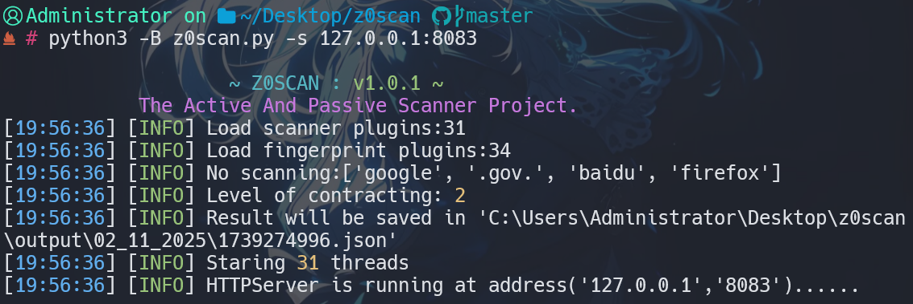
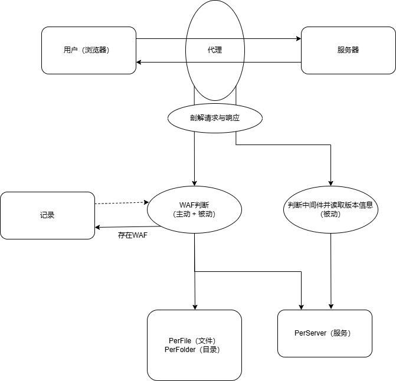

<h1 align="center">
  <br>
  
  <br>
   Z0SCAN
  <br>
</h1>

<h3 align="center">The Active And Passive Scanner Project based on Python3.</h4>


<h4 align="center" dir="auto">
  <a href="https://github.com/JiuZero/z0scan/blob/master/README.MD">中文</a> | English
</p>


## Disclaimer

> This project and the included tools are only intended for legally authorized enterprise security construction activities. Any consequences caused by user abuse are not the responsibility of the author. When using this tool, you should ensure that the behavior complies with local laws and regulations and has obtained sufficient authorization. Do not scan unauthorized targets.

> If you engage in any illegal behavior while using this project and its tools, you shall bear the corresponding consequences on your own, and we will not assume any legal or joint liability Your use or any other express or implied acceptance of this agreement shall be deemed as your reading and agreement to be bound by this agreement.


## Rapid Deployment

Install by cloning from GitHub

```
git clone https://github.com/JiuZero/z0scan
cd z0scan
pip install -r requirements.txt
python3 z0scan.py
```


## Usage

```
usage: z0scan [options]

options:
  -h, --help            show this help message and exit
  -v, --version         Show program's version number and exit
  --debug               Show programs's exception
  -l {1,2,3,4}, --level {1,2,3,4}
                        Different level use different payload: 1-4(The default
                        numbers see config.py)

Proxy:
  Passive Agent Mode Options

  -s SERVER_ADDR, --server-addr SERVER_ADDR
                        Server addr format:(ip:port)

Target:
  Options has to be provided to define the target(s)

  -u URL, --url URL     Target URL (e.g. "http://www.site.com/vuln.php?id=1")
  -f URL_FILE, --file URL_FILE
                        Scan multiple targets given in a textual file

Request:
  Network request options

  -p PROXY, --proxy PROXY
                        Use a proxy to connect to the target URL,Support
                        http,https,socks5,socks4 eg:http@127.0.0.1:8080 or
                        socks5@127.0.0.1:1080
  --timeout TIMEOUT     Seconds to wait before timeout connection(The default
                        numbers see config.py)
  --retry RETRY         Time out retrials times(The default numbers see
                        config.py)
  --random-agent        Use randomly selected HTTP User-Agent header value

Output:
  Output options

  --html                When selected, the output will be output to the output
                        directory by default, or you can specify
  --json JSON           The json file is generated by default in the output
                        directory, you can change the path

Optimization:
  Optimization options

  -t THREADS, --threads THREADS
                        Max number of concurrent network requests(The default
                        numbers see config.py)
  --disable DISABLE [DISABLE ...]
                        Disable some plugins (e.g. --disable xss webpack)
  --able ABLE [ABLE ...]
                        Enable some moudle (e.g. --enable xss webpack)
  --ignore-waf          Ignore the WAF for detection
```


## Scanner List

- PerServer

|Name|Description|Way|Demand|
|:---:|:----:|:---:|:---:|
|IisShortname|IIS short file name vulnerability detection.|Active|/|
|IisNginxParse|IIS and Nginx service resolution vulnerability.|Active|/|
|ErrorPage|Error page sensitive information leaked.|Active|/|
|OSSBucketTakeover|OSS bucket takes over.|Active|/|
|OSSFileUpload|Upload any file from an OSS bucket|Active|/|
|NetXSS|.NET XSS|Active|Level==4,NoWaf|
|NginxCRLF|Nginx CRLF inject|Active|/|
|NginxWebcache|Nginx Misconfiguration - Cache Clearing|Active|/|
|SwfFiles|Flash XSS|Active|Level==4,NoWaf|
|NginxVariableLeakage|Nginx Misconfiguration - variable leakage|Active|/|
|Idea|Idea directory resolution |Active|Level>=2|
|BackupDomain|Domain-based backup file detection|Active|/|

- PerFile

|Name|Description|Way|Demand|
|:---:|:----:|:---:|:---:|
|SQLiBool|SQL Boolean blind detection|Active|NoWaf|
|SQLiTime|SQL Time blind detection|Active|NoWaf|
|SQLiError|SQL Error injection detection|Active|/|
|CommandAspCode|ASP code execution|Active|Nowaf,Level>=3|
|CommandPhpCode|PHP code execution|Active|NoWaf,Level>=3|
|SSTI|SSTI injection|Active|Nowaf|
|XSS|Based on JS semantic XSS discovery|Passive|/|
|AnalyzeParameter|Inverse parameter analysis|Passive|/|
|JsSensitiveContent|Js sensitive information leakage|Passive|/|
|CommandSystem|System command execution|Active|NoWaf,Level>=3|
|DirectoryTraversal|Directory traversal|Active|NoWaf|
|Unauth|Unauthorized access|Active|/|
|PhpRealPath|Php real path detection|Active|/|


- PerFolder

|Name|Description|Way|Demand|
|:---:|:----:|:---:|:---:|
|BackupFolder|Backup file scanning|Active|Level>=2|
|DirectoryBrowse|Directory traversal|Active|/|
|PhpinfoCraw|Phpinfo file detection|Active|Level>=2|
|RepositoryLeak|Repository source code leak|Active|NoWaf,Level>=2|

- Note: The loading premise ignores fingerprint elements (the ability to ignore fingerprint elements is still under development)


## Passive Process

<h1 align="center">

</h1>


## Changes

Look at [CHANGELOG](https://github.com/JiuZero/z0scan/blob/master/doc/CHANGE.MD)


## Thanks & Reference

- The prototype was developed by w8ay's [W13SCAN](https://github.com/w-digital-scanner/w13scan)
- The heuristic WAF detection logic originally came from Nmap's [http-waf-detect.nse](http://seclists.org/nmap-dev/2011/q2/att-1005/http-waf-detect.nse)
- The logic of IisShortname.by originally came from lijiejie's [IIS_shortname_Scanner](https://github.com/lijiejie/IIS_shortname_Scanner)
- The detection logic for some Nginx service vulnerabilities comes from [nginxpwner](https://github.com/stark0de/nginxpwner)
- The passive rules of WAF come from [wafw00f](https://github.com/EnableSecurity/wafw00f)


## Contact

```
QQ: 3973580951
QQemail: jiuzer0@qq.com
WeiXin: JiuZer0
```


## License

GPL-2.0 License

Look at [LICENSE](https://github.com/JiuZero/z0scan/blob/master/LICENSE)